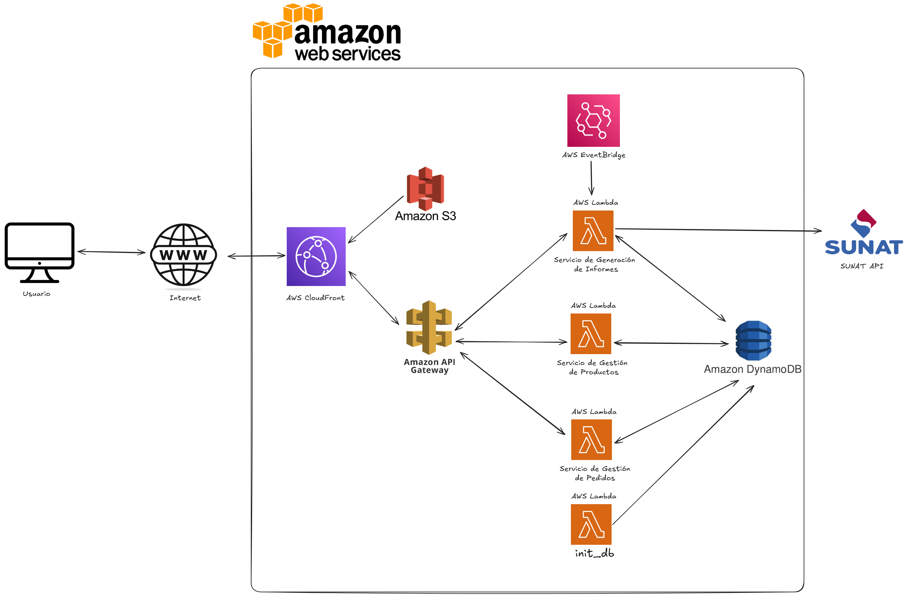

# 🧾 Proyecto: Infraestructura como Código – Sistema para Minimarkets

Este proyecto implementa una arquitectura **serverless** en AWS utilizando **Terraform**, simulando un sistema de gestión de productos, pedidos e informes para una cadena de minimarkets. El sistema incluye un frontend estático, API REST, base de datos SQL, funciones Lambda y ejecución automática mediante EventBridge.

# Problemática:
Don Pepe, es una cadena de minimarkets con más de 30 tiendas a nivel nacional en el Perú, de modernizar y automatizar la gestión de sus operaciones. Actualmente, los procesos de registro de productos, pedidos e informes se realizan de manera manual, lo que genera ineficiencias, errores humanos y dificultades para escalar sus operaciones.

Ante esta situación, Don Pepe nos ha contratado para desarrollar un sistema que permita automatizar sus servicios y optimizar la gestión de sus tiendas. Este sistema busca:

Centralizar la información de productos y pedidos en una base de datos.
Proveer un frontend accesible para los empleados de las tiendas.
Exponer una API REST para interactuar con los datos de manera eficiente.
Generar informes automáticos sobre las operaciones de las tiendas.
Implementar una infraestructura escalable y segura utilizando AWS y Terraform.
---

## 📦 Arquitectura General

El sistema sigue esta arquitectura:



*Diagrama de arquitectura serverless con S3, Lambda, API Gateway, RDS y EventBridge.*

---

## 🚀 Servicios AWS Utilizados

| Servicio AWS          | Uso Principal                                                                 |
|-----------------------|-------------------------------------------------------------------------------|
| **S3**                | Almacena el sitio estático (HTML con botones de acción)                      |
| **CloudFront**        | Distribuye el frontend de forma rápida y segura                              |
| **API Gateway**       | Expone tres endpoints públicos: `/productos`, `/pedidos`, `/informes`        |
| **Lambda**            | Cuatro funciones: `init_db`, `gestionar_producto`, `gestionar_pedido`, `generar_informes` |
| **RDS (PostgreSQL)**  | Base de datos relacional para almacenar productos y pedidos                  |
| **EventBridge**       | Ejecuta automáticamente la Lambda `generar_informes`                        |
| **IAM Roles/Policies**| Permisos específicos para cada Lambda y acceso seguro a RDS                  |

---

## ✅ Funcionalidades Principales

- **Registrar productos:** Crear nuevos productos o deshabilitarlos.
- **Registrar pedidos:** Consultar productos habilitados y registrar pedidos.
- **Generar informes:** Crear un informe con los pedidos de los últimos 30 días.
- **Ejecución automática:** Generar informes automáticamente mediante EventBridge.
- **Infraestructura como código:** Toda la infraestructura está escrita en Terraform.

## 🛠️ Instalación de Dependencias para PostgreSQL

Para que las funciones Lambda puedan interactuar con la base de datos PostgreSQL, es necesario instalar el paquete `pg`. Sigue estos pasos para cada función Lambda que lo requiera:

1. Navega al directorio de la función Lambda. Por ejemplo, para `gestionar_productos`:
   ```bash
   cd lambda/gestionar_productos
2. Inicializa un proyecto Node.js (si aún no lo has hecho):
    npm init -y
3. Instala el paquete pg:
    npm install pg
---

---

## 🧹 Eliminación de Recursos

Para eliminar todos los recursos creados, sigue estos pasos:

1. **Eliminar recursos específicos primero:**

   Ejecuta el siguiente comando para destruir únicamente las funciones Lambda:

   ```bash
   $targets = @(
     "-target=aws_lambda_function.generar_informes",
     "-target=aws_lambda_function.gestionar_pedidos",
     "-target=aws_lambda_function.init_db",
     "-target=aws_lambda_function.guardar_producto"
   )
   terraform destroy $targets

    Y luego:

   terraform destroy
---

## 🗄️ Base de Datos

La base de datos utilizada en este proyecto es PostgreSQL, y su estructura actual es la siguiente:

```sql
CREATE TABLE productos (
  id VARCHAR(255) PRIMARY KEY,
  nombre VARCHAR(255) NOT NULL,
  descripcion TEXT,
  cantidad INT NOT NULL,
  habilitado BOOLEAN NOT NULL
);

CREATE TABLE pedidos (
  idpedido VARCHAR(255) PRIMARY KEY,
  fecha TIMESTAMP NOT NULL
);

CREATE TABLE pedido_productos (
  idpedido VARCHAR(255) NOT NULL,
  idproducto VARCHAR(255) NOT NULL,
  cantidad INT NOT NULL,
  PRIMARY KEY (idpedido, idproducto),
  FOREIGN KEY (idpedido) REFERENCES pedidos(idpedido) ON DELETE CASCADE,
  FOREIGN KEY (idproducto) REFERENCES productos(id)
);
```

## 👥 Autores

- **Baltodano León, Karlita**  
- **Morales Benites, Charlie**  
- **Veneros Loloy, Johan**  